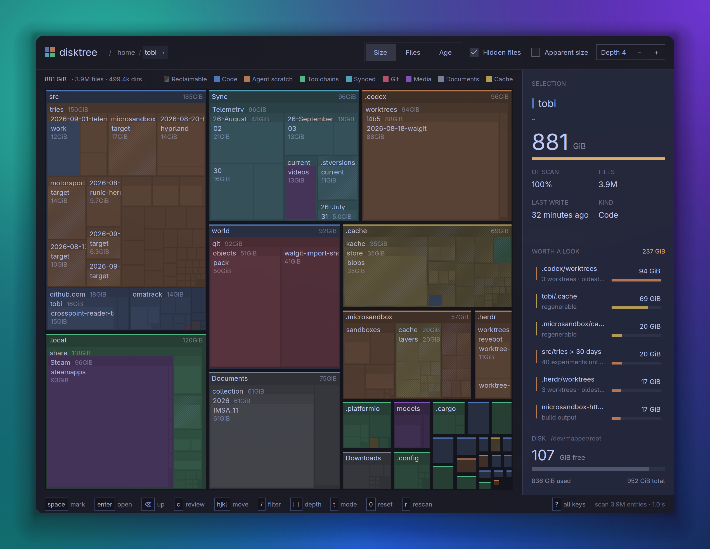

# Disktree for macOS

[](https://github.com/AdriaBA/disktree-macos/releases/latest)
[](https://github.com/AdriaBA/disktree-macos/releases/latest)
[](https://github.com/AdriaBA/disktree-macos/releases/latest)
[](https://github.com/tobi/disktree)

A visual disk-space explorer for Mac. See what is filling a disk, inspect it as
an interactive treemap, mark what can go, review the list, and move files to the
macOS Trash.

> This is a **Mac-focused fork and distribution** of
> [tobi/disktree](https://github.com/tobi/disktree). Application development and
> source releases come from upstream. This repository provides a macOS-first
> landing page, installation guidance, and verified mirrors of upstream Mac
> release files.



## Download for Mac

Current release: **0.10.0** · Requires **macOS 11 or newer**.

| Your Mac | Download | How to identify it |
| --- | --- | --- |
| Apple Silicon — M1, M2, M3, M4, M5 or newer | [Download Apple Silicon ZIP](https://github.com/AdriaBA/disktree-macos/releases/download/v0.10.0/disktree-0.10.0-aarch64-macos.zip) | Apple menu → **About This Mac** says **Chip: Apple…** |
| Intel Mac | [Download Intel ZIP](https://github.com/AdriaBA/disktree-macos/releases/download/v0.10.0/disktree-0.10.0-x86_64-macos.zip) | About This Mac says **Processor: Intel…** |

Both ZIP files are mirrored byte-for-byte from the corresponding
[tobi/disktree v0.10.0 release](https://github.com/tobi/disktree/releases/tag/v0.10.0)
and published with SHA-256 checksums.

```text
efe3c3ba4af7ce04c3dd117fd04e11127ac9779e61183e55dc264709cb369c49  disktree-0.10.0-aarch64-macos.zip
1e24d718bd4a852f8021ee6395c28b33266deda7ac7861227e913a803daae87d  disktree-0.10.0-x86_64-macos.zip
```

## Install

1. Download the ZIP for your Mac.
2. Open the ZIP.
3. Drag **disktree.app** into **Applications**.
4. Open **disktree** from Applications or Spotlight.

These v0.10.0 mirror builds are ad-hoc signed, not Developer ID signed or
notarized. Gatekeeper blocks the first launch. Try opening the app once and
then use:

**System Settings → Privacy & Security → Open Anyway**

macOS then asks for Touch ID or an administrator password.

Do not disable Gatekeeper globally. See the detailed
[installation and verification guide](docs/INSTALL.md).

## Give it Full Disk Access

Without Full Disk Access, macOS hides data belonging to Mail, Messages, Safari,
other apps, and the Trash. Disktree will still run, but those locations are
reported as unreadable.

For a complete scan:

1. Open **System Settings**.
2. Go to **Privacy & Security → Full Disk Access**.
3. Add or enable **disktree**.
4. Quit and reopen the app.

macOS may separately ask for Desktop, Documents, and Downloads access. Learn
what the permissions mean in [Privacy and permissions](docs/PRIVACY.md).

## What it does

- Shows folders and files as a nested treemap sized by real disk usage.
- Scans your home folder by default or the complete startup disk on request.
- Highlights caches, build output, package stores, and other reclaimable space.
- Lets you mark multiple paths before anything changes.
- Reviews every marked path before removal.
- Uses the native macOS Trash for recoverable removal.
- Avoids downloading cloud-only iCloud, Dropbox, and File Provider content.
- Understands common Mac space consumers such as Xcode DerivedData,
  DeviceSupport, and `~/Library/Logs`.
- Supports both light and dark appearance.

## Safety model

Marking is reversible and never deletes anything. Removal happens only from the
review screen. Disktree refuses dangerous targets including the filesystem
root, your home directory, system trees, mount points, paths outside the scan,
and directories containing mounted filesystems. Symlinks are unlinked rather
than followed.

Permanent deletion is available, but the native Trash is the default. Review
important folders and repositories before removing them.

## Useful controls

| Key | Action |
| --- | --- |
| Arrow keys / Tab | Move between tiles |
| Return | Open the selected directory |
| Backspace / Escape | Go up one level |
| Space or `x` | Mark or unmark |
| `c` | Review marked items |
| `r` / `⌘R` | Scan again |
| `g` | Scan the whole startup disk |
| `d` | Toggle disk usage and apparent size |
| `⌘O` | Choose another directory |
| `⌘[` / `⌘]` | Go back or forward |
| `o` / `⌘⇧R` | Show the selection in Finder |
| `/` | Filter by name |
| `?` | Show every shortcut |
| `q` / `⌘Q` | Quit |

On the review screen, `m` selects the Trash, `p` selects permanent deletion,
`s` saves the list, and `a` copies it as a prompt for a coding agent.

## macOS disk-usage notes

- Finder may report more free space because it includes purgeable caches and
  local snapshots. Disktree uses the same conservative free-space figure that
  `df` reports.
- APFS cloned files can each appear at their full size even when they currently
  share physical blocks.
- Time Machine local snapshots are not ordinary files, so they do not appear in
  the treemap.
- Cloud-only files are skipped to prevent a scan from downloading them.

## Build from source

You need Rust 1.97 or newer and Xcode or the Xcode Command Line Tools.

```sh
git clone https://github.com/AdriaBA/disktree-macos.git
cd disktree-macos
make bundle      # target/bundle/disktree.app plus a ZIP
make install     # ~/Applications/disktree.app
```

See [Building and signing](docs/BUILDING.md) for tests, Developer ID signing,
and notarization.

## Updates and support

- Application bugs and feature requests belong in
  [tobi/disktree](https://github.com/tobi/disktree/issues).
- Problems specific to these Mac instructions or mirrored release files belong
  in [this repository](https://github.com/AdriaBA/disktree-macos/issues).
- Check [Releases](https://github.com/AdriaBA/disktree-macos/releases) for new
  Mac builds.

## Credits and license

Disktree is created and maintained by
[Tobias Lütke and upstream contributors](https://github.com/tobi/disktree/graphs/contributors).
This fork preserves the upstream Git history and links every distributed binary
to its upstream release.

Licensed under the [MIT License](LICENSE).
